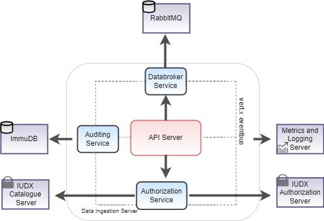

Setup Guide
----

This document contains the installation and configuration processes of the external modules of each Verticle in IUDX Data Ingestion Pipeline Server.

<p align="center">

</p>


Data Ingestion Pipeline server connects with various external dependencies namely :

 - `RabbitMQ` : used to publish and subscribe different types of messages or events.
 - `ImmuDB` : used to store metering related information.
 
 
## Setting up RabbitMQ
 
> Refer to the docker files available [here](https://github.com/datakaveri/iudx-deployment/blob/master/Docker-Swarm-deployment/single-node/databroker) to 
> setup RMQ.


In order to connect to the appropriate RabbitMQ instance, required information such as dataBrokerIP,dataBrokerPort etc. should be updated in the DataBrokerVerticle module available in [config-example.json](example-configs/config-example.json).


**DataBroker Verticle**

```
{
    "id": "iudx.data.ingestion.server.databroker.DataBrokerVerticle",
    "verticleInstances": <num-of-verticle-instances>,
    "dataBrokerIP": "<rabbit mq ip>",
    "dataBrokerPort": <port-number>,
    "dataBrokerVhost": "<Vhost-name>",
    "dataBrokerUserName": "<username-for-rmq>",
    "dataBrokerPassword": "<password-for-rmq>",
    "dataBrokerManagementPort": <time-in-milliseconds>,
    "connectionTimeout": <time-in-milliseconds>,
    "requestedHeartbeat": <time-in-milliseconds>,
    "handshakeTimeout": <time-in-milliseconds>,
    "requestedChannelMax": <time-in-milliseconds>,
    "networkRecoveryInterval": <time-in-milliseconds>,
    "automaticRecoveryEnabled": "true"
}
```

## Setting up ImmuDB

> Refer to the docker files available [here](https://github.com/datakaveri/iudx-deployment/blob/master/Docker-Swarm-deployment/single-node/immudb) to setup > ImmuDB.

In order to connect to the appropriate ImmuDB database, required information such as meteringDatabaseIP,meteringDatabasePort etc. should be updated in the MeteringVerticle module available in [config-example.json](configs/config-example.json).

```
{
    "id": "iudx.data.ingestion.server.databroker.DataBrokerVerticle",
    "verticleInstances": <num-of-verticle-instances>,
    "meteringDatabaseIP": "localhost",
    "meteringDatabasePort": <port-number>,
    "meteringDatabaseName": <database-name>,
    "meteringDatabaseUserName": <username-for-immudb>,
    "meteringDatabasePassword": <password-for-immudb>,
    "meteringPoolSize": <pool-size>
}
```

**Metering Table Schema**

```sql
CREATE TABLE IF NOT EXISTS rsauditingtable
(
    id uuid NOT NULL,
    api varchar NOT NULL,
    userid varchar NOT NULL,
    epochtime integer NOT NULL,
    resourceid varchar NOT NULL,
    isotime timestamp with timezone NOT NULL,
    providerid varchar NOT NULL,
    CONSTRAINT metering_pk PRIMARY KEY (id)
);
```
